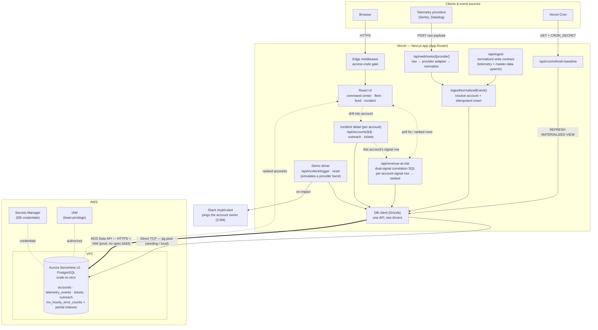

# Sybil — Customer observability, ranked by revenue at risk

> Customer observability for B2B SaaS: Sybil correlates your product's telemetry to the revenue each customer represents and surfaces the accounts silently breaking — ranked by revenue at risk — before they open a support ticket or churn.

**Who it's for:** Any B2B SaaS with usage telemetry and customers on ARR. This demo runs on an identity vendor — where one failure is both an outage and a renewal risk, which makes the two-signal correlation vivid.

**The problem:** Identity failures can cause a surge in support tickets, or even a renewal churn. 

Sybil ingests the vendor's identity telemetry and tells them *which account is exposed to a failure right now*, and how much renewal that puts at risk, and enables CX teams to proactively reach out to key accounts.

When a customer is silently broken — a failing integration, a degrading API — they may not file a support ticket right away. They quietly lose trust, then churn, and the damage is invisible until the renewal conversation. Sybil ingests the product's telemetry, tells you which account is breaking right now and how much renewal revenue is at risk, and lets CX teams proactively reach out to key accounts.

---

## Why Aurora PostgreSQL

**Sybil runs two complementary detection strategies over one normalized identity-telemetry landing table — statistical rate-anomaly baselining on deprovisioning-sync failures and exposure scoring on discrete stale-access violations — unified into a single revenue-weighted risk ranking, all in SQL.** That dual-signal correlation (window functions, `STDDEV_POP`, `MODE() WITHIN GROUP`, time-window CTEs, blast-radius math) belongs *in the database* — Aurora runs it at scale behind a serverless-friendly pooled endpoint.

---

## The Core Database Query

Two detectors, one landing table, one risk score — defined in [`src/db/queries.ts`](src/db/queries.ts), exposed live via `/api/revenue-at-risk`, and viewable in-app via **"View query"**. The *right detector for each signal*:

- **Rate anomaly (z-score).** High-volume deprovisioning-sync failures are baselined per tenant over a trailing **7-day hourly window**; a live burst that exceeds the tenant's own `mu + 3σ` (and a floor) is the **leading indicator**. *"Acme's sync-failure rate is 16× its baseline."*
- **Exposure scoring.** Discrete `stale_access` violations are **rare and high-severity** — a baseline of zero, so z-score is the *wrong* tool. They're scored by **blast radius × sensitivity × dwell time**: one terminated Super-Admin still holding a live session is already a P1.
- **Blended risk score** `= 0.35·ARR + 0.30·exposure + 0.20·anomaly + 0.15·renewal-proximity`, `ORDER BY risk_score DESC` — so a whale with a confirmed exposure near renewal outranks a bigger tenant whose pipeline is merely wobbling.

A tenant surfaces when it is **anomalous OR carries an open exposure**. The full annotated CTE query is the showpiece behind the **View query** button.

## Data model

Four tables, defined with Drizzle in [`src/db/schema.ts`](src/db/schema.ts):

| table | role |
| --- | --- |
| `accounts` | the vendor's tenants — `tier`, `arr` (the dollar weight), `csm_owner`, `renewal_date`, `region` |
| `telemetry_events` | one normalized landing table, four semantics — `event_type` (`error`\|`latency`\|`stale_access`\|`policy_violation`), `severity`, `error_signature`, `subject` (the identity actor), `occurred_at` |
| `tickets` | a linked case from the tenant's own tooling — fetched live as context on the incident page |
| `outreach` | human-in-the-loop draft **and** the incident record — `draft_body`, `approved_by`, and the lifecycle `incident_status` (active\|resolved) × `outreach_status` (none\|initial_sent\|resolution_sent) |

> **Where ARR comes from:** `accounts` is master data. In production it's upserted by `external_ref` from the system of record (CRM / billing — Salesforce, Stripe) the same any-source-into-Aurora way telemetry lands through `/api/ingest`; a "sync" is just a thin adapter that calls that upsert, not a poller. The seed bootstraps it. (This keeps the revenue weighting in the risk score honest — the dollar figures trace back to billing, not to hand-entered numbers.)

## The surfaces

0. **Landing + SSO gate** (`/` → `/login`) — a one-screen orientation (what it does, who it's for, the one-sentence Aurora pitch) behind a themed **"Sign in with SSO"** curtain. On-thesis (Sybil's customers *are* SSO vendors) and clearly labelled a demo, not real auth. Signing in resets to calm, warms the cluster, and drops you into the command center — which holds green a beat, then **auto-fires the incident**, so an unattended judge sees the full green→red arc without clicking. Manual Trigger/Reset controls stay for driving it live.
1. **Command center** (hero) — a live metrics band (Monitored ARR, accounts, errors/min, a continuous fleet-telemetry sparkline) beside the emotional centerpiece: a large **Revenue-at-Risk** figure that rests at a calm green `$0` and counts up into pulsing red the instant real dollars are erroring.
2. **Fleet constellation** — the whole book of business as a field of living dots, one per account, **sized by ARR**. A gently breathing sea of green at rest; affected dots flare red and float to the front on impact. Click a dot to open its incident page.
3. **Account-status feed** — one always-on table, sorted active-first then by ARR; rows slide into place as order changes. Each affected row walks a derived status — `Impacted` (red) → `Notified` (amber) → `Resolved` (calm green). Includes **View query**.
4. **Incident page** (`/incidents/[accountId]`) — a **"Why Sybil flagged this tenant"** panel making the dual signal legible (the rate anomaly *N× baseline* beside the confirmed stale-access exposure — subject, entitlement, dwell time — and the risk score); the sync-failure timeline; and the human-in-the-loop outreach lifecycle: edit the draft → **Send** → **Mark resolved** → **Send resolution update**. Nothing sends without a human's name on it.

> **Design discipline:** a calm-but-alive command center at rest — gently breathing green, monitored-ARR ticking — that *escalates* into red as an incident fires (Revenue-at-Risk counting up, dots flaring, an ambient screen-edge glow). The saturated red is reserved exclusively for genuine impact, so the escalation reads as real, not decorative.

---

## Run locally

Requires Node 18+ and pnpm. You need a Postgres reachable at `DATABASE_URL` — local Docker is fine for the demo, Aurora for production.

```bash
pnpm install

# 1. Start a local Postgres (or point DATABASE_URL at Aurora)
docker run -d --name sybil-pg \
  -e POSTGRES_PASSWORD=postgres -e POSTGRES_USER=postgres -e POSTGRES_DB=sybil \
  -p 5432:5432 postgres:16-alpine

# 2. Configure env
cp .env.example .env.local        # default URL already points at the container above

# 3. Create the schema + seed ~20 healthy tenants and their 7-day baseline (all green)
pnpm db:push
pnpm db:seed
pnpm db:matview                   # build the baseline rollup + partial indexes (see docs/PERFORMANCE.md)

# 4. Run
pnpm dev                          # http://localhost:3000
```

### Demo flow (≈40 seconds)

1. Open the app → **Sign in with SSO** (one click). The command center loads all green, **0 tenants at risk** (every tenant has a low baseline sync-failure hum; none is anomalous) — then, after a beat, the incident **fires itself**. (Driving it live? Use the **Trigger incident** button instead.)
2. Four tenants' deprovisioning pipelines start failing; two (Acme, Helios) also surface a confirmed stale-access violation. The dashboard flips to red: toast + banner, rows sorted by **risk score** — **Acme #1** (`exposure + anomaly`, terminated Super-Admin exposed 4h and caught at the first failures, renews in 23d) above the anomaly-only tenants.
3. Click Acme → the **"Why Sybil flagged this tenant"** panel: *16× baseline* sync failures beside the confirmed exposure (`jane.doe@acme.com` · Super Admin · exposed 4h, flagged at the first failures), with the risk score. Hit **Check for related tickets** — Acme comes back *silent* ("the customer hasn't reported this"), which is the whole point.
4. Edit the outreach draft → **Send** (logs to the server console, or posts to `SLACK_WEBHOOK_URL`). The row turns amber `Notified`.
5. **Mark resolved**, then **Send resolution update** — the row settles to calm green `Resolved`.
6. Hit **View query** to show the live dual-signal CTE SQL.
7. Click **Reset** — the incident clears but the 7-day baseline survives.

## Scripts

| command | does |
| --- | --- |
| `pnpm dev` | run the app |
| `pnpm db:push` | create/sync the schema (Drizzle Kit, `--force`) |
| `pnpm db:seed` | reset + seed ~20 healthy tenants and their 7-day sync-failure baseline |
| `pnpm db:matview` | create the baseline materialized view + partial indexes ([`docs/PERFORMANCE.md`](docs/PERFORMANCE.md)); refresh via `/api/cron/refresh-baseline` |
| `pnpm db:studio` | browse the data in Drizzle Studio |
| `pnpm demo:webhook [url] [count] [account_ref]` | fire a burst of **real raw Sentry webhooks** at `/api/webhooks/sentry` — the live "this is a real provider pipeline" demo |
| `pnpm build` | production build |

---

## Architecture

How the application connects to its back-end components — from a judge's browser and the
external telemetry providers, through the Next.js app on Vercel, to Aurora on AWS.



**Reading the diagram**

- **One write contract, many sources.** Real provider webhooks (`/api/webhooks/[provider]`) run a per-provider adapter to normalize a raw payload; `/api/ingest` is that same normalized contract exposed directly (used for programmatic telemetry and CRM/billing master-data upserts). Both funnel through `ingestNormalizedEvent()` — account resolution + idempotent insert into the single `telemetry_events` landing table. The **demo driver** (`/api/incident/trigger` · `reset`) just simulates a provider burst against that same path so the green→red arc runs unattended.
- **Two ways the app reaches Aurora** (same Drizzle call sites, switched by `USE_DATA_API`): a pooled **`pg` TCP** connection for local dev and bulk seeding, and the **RDS Data API** (HTTPS + IAM, no open `5432`) for the hardened Vercel deployment outside the VPC. See [`src/db/index.ts`](src/db/index.ts).
- **The read path** is `/api/revenue-at-risk`, the dual-signal revenue-weighted correlation query ([`src/db/queries.ts`](src/db/queries.ts)) the UI polls every 5s. It returns a **full signal row per affected account** (z-score, exposure count, signal kind, risk score) — the ranking is just an `ORDER BY` over that. Its slow-moving baseline reads from the `mv_hourly_error_counts` materialized view, refreshed out-of-band by **Vercel Cron** → `/api/cron/refresh-baseline` (`REFRESH MATERIALIZED VIEW CONCURRENTLY`).
- **Drilling into one account** (`/incidents/[accountId]`) reuses that same per-account signal row and composes it with `/api/accounts/[id]` (master data), `/api/outreach` (draft + lifecycle), and `/api/tickets` — the ranked board and the per-account "why flagged" panel are the same data at two granularities, not two pipelines.
- **Aurora** scales to zero between incidents; **Secrets Manager** holds the DB credentials and **IAM** authorizes the Data API path. Slack is a notify side effect — when an account is impacted it pings that account's owner (CSM) and links to the incident page; it never approves or sends anything.

---

## Deploying to AWS + Vercel

The database runs on AWS (provisioned by [`terraform/`](terraform/)); the app runs on Vercel and connects back to it. The infra is a minimal VPC and **Aurora Serverless v2 (PostgreSQL)** configured to **scale to zero** (`min_capacity = 0`) so an idle cluster costs ~nothing — right for an app that sits unattended through a multi-week judging window. No RDS Proxy (it holds open connections, which blocks scale-to-zero); Sybil's `pg` Pool is cached on `globalThis` per warm container instead ([`src/db/index.ts`](src/db/index.ts)).

**Prerequisites:** AWS credentials (`aws sts get-caller-identity` to confirm), Terraform ≥ 1.5, and the Vercel CLI.

### 1. Provision the database

```bash
cd terraform
# Set local_admin_cidr to your public IP/32 in terraform.tfvars — this opens 5432
# to just your laptop for the seed step. Find it: curl -s https://checkip.amazonaws.com
terraform init
terraform apply          # ~10–15 min; Aurora cluster creation is the slow part
terraform output         # note the endpoint + ARNs (some are -raw / sensitive)
```

### 2. Migrate + seed (from your laptop, over TCP)

```bash
cd ..
# The password lives in Secrets Manager, not the outputs — fetch it:
PASS=$(aws secretsmanager get-secret-value --secret-id sybil/aurora/credentials \
  --query SecretString --output text | jq -r .password)
export DATABASE_URL="postgresql://sybil_admin:${PASS}@<endpoint>:5432/sybil?sslmode=no-verify"   # NOT sslmode=require — newer pg rejects the RDS CA chain

pnpm db:push             # create schema
pnpm db:seed             # load demo data — keep this on direct TCP; the Data API is slow for bulk inserts
pnpm db:matview          # create mv_hourly_error_counts + partial indexes (refresh via /api/cron/refresh-baseline)
```

> **Order matters:** run `db:matview` after `db:seed`. The correlation query reads the
> baseline from `mv_hourly_error_counts`, so the view must exist or `/api/revenue-at-risk`
> errors with `relation "mv_hourly_error_counts" does not exist`. Re-run `db:matview`
> (or hit `/api/cron/refresh-baseline`) after any re-seed. See [`docs/PERFORMANCE.md`](docs/PERFORMANCE.md).

### 3. Deploy the app

```bash
# Set the DB env vars in Vercel (see "How the app reaches the DB" below), then:
vercel --prod
```

All API routes are `force-dynamic` with `maxDuration = 60`, so the first request can wait out a scale-to-zero resume instead of timing out.

### How the app reaches the DB

Two paths, switched by env vars ([`src/db/index.ts`](src/db/index.ts)):

| | **Direct TCP** (default) | **RDS Data API** (recommended for a long-lived deploy) |
|---|---|---|
| Env vars | `DATABASE_URL` → cluster endpoint | `USE_DATA_API=true` + `RDS_RESOURCE_ARN` / `RDS_SECRET_ARN` / `AWS_REGION` / `AWS_ACCESS_KEY_ID` / `AWS_SECRET_ACCESS_KEY` (all `terraform output`s) |
| Transport | TCP — needs `enable_public_db_access = true` (5432 open to `0.0.0.0/0`, since Vercel has no fixed egress IP) | HTTPS + IAM, **no open port**, no pool to keep warm |
| Use when | Quick demo on a short-lived cluster. **Not** for weeks of unattended uptime | Anything long-lived — the right fit for Vercel + scale-to-zero |

**Recommended order:** deploy on direct TCP first (it's the tested path) to get a working
demo fast, then cut over to the Data API for the **hardened end-state** — no public DB
endpoint, no open port, IAM-authed over HTTPS:

1. Set the `USE_DATA_API` + `RDS_*` + `AWS_*` env vars in Vercel; redeploy.
2. Verify the dashboard loads and **View query** returns rows. ⚠️ The Data API path can't be exercised against local Postgres — validate it against real Aurora here before the next step.
3. Close the public surface:
   ```bash
   terraform apply -var enable_public_db_access=false -var publicly_accessible=false
   ```
   `enable_public_db_access=false` removes the `0.0.0.0/0` SG rule; `publicly_accessible=false`
   removes the instance's public endpoint entirely. The admin-IP `/32` rule stays. To
   re-seed later, flip `publicly_accessible=true` briefly (the app keeps running on the
   Data API throughout — it never used the endpoint).
4. Verify the hole is closed: the cluster SG should show only your admin `/32` on 5432,
   and a TCP connect from any other IP should be refused.

> **Cold start:** a paused cluster takes ~15–30s to resume; the app shows a "Resuming Aurora Serverless v2 from zero…" screen on first load (`maxDuration = 60` keeps the request alive through it). To avoid it entirely for a live demo, set `aurora_min_acu = 0.5` for the demo window (~$0.06/hr) so it never pauses. **Cost:** keep your own `pnpm dev` on local Docker — a browser left open on the dashboard polls every 5s and prevents the cluster from ever pausing.
>
> **Teardown:** `cd terraform && terraform destroy`. `skip_final_snapshot = true` is set, so it's clean and immediate.

## Stack

Next.js (App Router) · TypeScript · Tailwind + shadcn/ui · Drizzle ORM · Aurora PostgreSQL · recharts · Sonner.

## Out of scope (intentionally)

No auth, user management, settings, onboarding, multi-tenancy, or real Slack OAuth. Single demo workspace — every hour outside the four surfaces is wasted.
